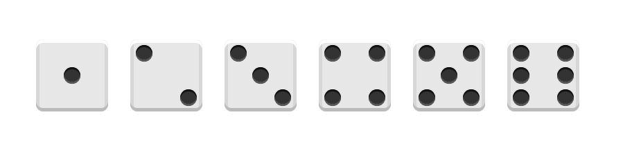

# flex 股子例子说明

> 图片展示




##  设计说明

> 骨子的样式

使用了两个关键词
* display:block; [参考网址](http://www.w3school.com.cn/cssref/pr_class_display.asp)
    * block 此元素将显示为块级元素，此元素前后会带有换行符。
    * inline 默认。此元素会被显示为内联元素，元素前后没有换行符。
    
* box-shadow; [参考网址](http://www.w3school.com.cn/cssref/pr_box-shadow.asp)

```css
display: block;
box-shadow: inset 0 3px #111, inset 0 -3px #555;

```


> 1个股子布局

````css
.first-face {
    display: flex;
    justify-content: center;
    align-items: center;
}
````

> 2个股子布局

* justify-content: space-between; 两端对齐，项目之间的间隔都相等。
* nth-of-type(2) ; 表示第二个元素
* align-self ; 单独设置了 align-items 的属性

```css
.second-face {
    display: flex;
    justify-content: space-between;
}

.second-face .pip:nth-of-type(2) {
    align-self: flex-end;
}
```

>> Html代码

```html
<div class="second-face">
    <span class="pip"></span>
    <span class="pip"></span>
</div>
```


> 3个股子布局

* 与2个的原理一样，使用了nth-of-type(2) 与 align-self:center;


> 4个股子布局

* 使用了column

```html
<div class="fourth-face">
    <div class="column">
        <span class="pip"></span>
        <span class="pip"></span>
    </div>
    <div class="column">
        <span class="pip"></span>
        <span class="pip"></span>
    </div>
</div>
```

* CSS设计
    * 首先把每一列当成一个，就变成了【两个股子的样子】
    * 在把上下两个细分成column

```css

.fourth-face, .sixth-face {
    display: flex;
    justify-content: space-between;
}

.fourth-face .column, .sixth-face .column {
    display: flex;
    flex-direction: column;
    justify-content: space-between;
}
```

> 5个股子布局

* 把中间的居中，其他的与第4个骨子一样

```css
.fifth-face .column:nth-of-type(2) {
    justify-content: center;
}
```


> 6个股子

* 同四个，有2列变成了3列


> 股子面

* 使用了[class$="face"] 表示用-face结尾的元素
* 详情见CSS选择器 [网址](http://www.w3school.com.cn/css/css_syntax_class_selector.asp)

```css
[class$="face"] {
    margin: 16px;
    padding: 4px;

    background-color: #e7e7e7;
    width: 104px;
    height: 104px;
    object-fit: contain;

    box-shadow:
            inset 0 5px white,
            inset 0 -5px #bbb,
            inset 5px 0 #d7d7d7,
            inset -5px 0 #d7d7d7;

    border-radius: 10%;
}
```
