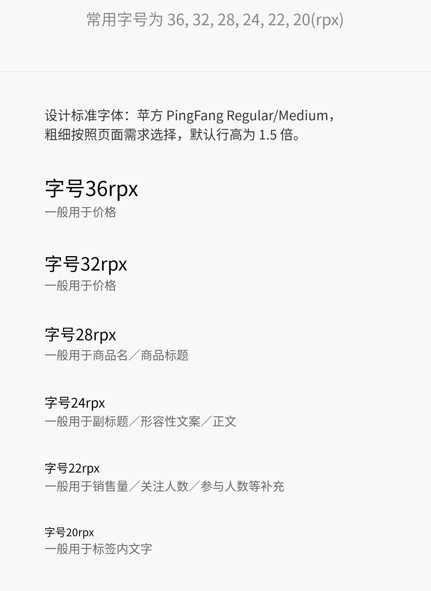
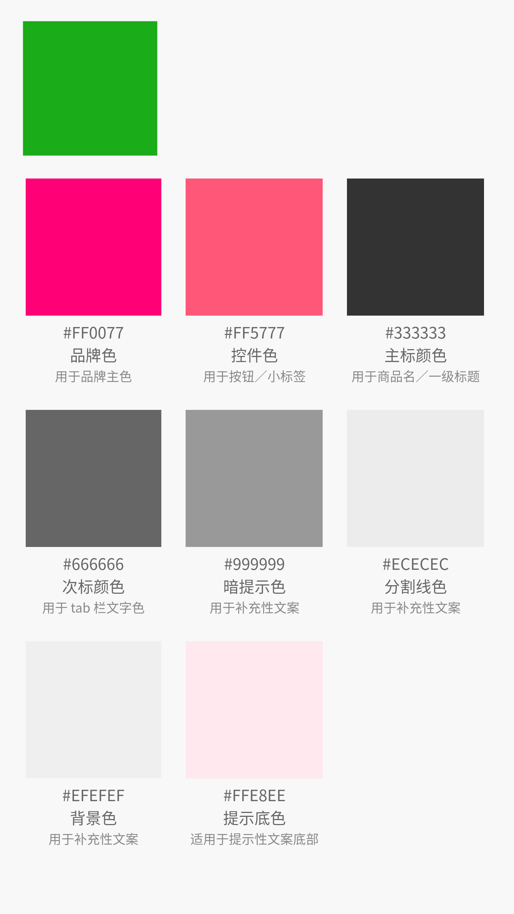
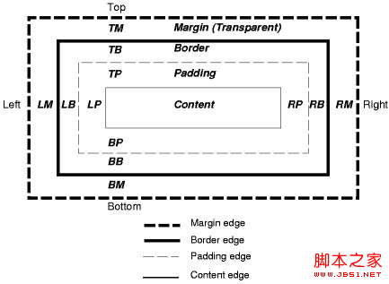

# HTML前端学习

> 目录

* [设计规范](#设计规范)
    * [间距](#间距)
    * [字体](#字体)
    * [颜色](#颜色)
* 参考网址
    * [有赞UI](https://www.youzanyun.com/zanui/weapp#/zanui/base/icon)
    * [微信小程序官网](https://mp.weixin.qq.com/debug/wxadoc/dev/component/text.html)
    * [蘑菇街UI](https://meili.github.io/min/)
    * [如何开发模板](https://www.jianshu.com/p/8a2a730d9e60)
* [开发工具安装](#开发工具安装)
    * [webstorm的使用](#webstorm的使用)
    * [minui的打包](#minui的打包)

* [HTML使用要点](html使用要点)
    * [Flex布局](#flex布局)
    * [边框距离](#边框距离)


<br> <br>

## 设计规范

### 间距

* 15px  Page左右缩进

### 字体

rpx  | px | 字体说明  | 
--------- | --------| --------|
36  | 18 |  一般用于价格
32  | 16 |  一般用于价格
28  | 14 |  一般用于商品名称；标题
24  | 12 |  一般用于副标题；形容性文本；正文
22  | 11  | 一般用于销售量；关注人数；参与人数；
20  | 10  | 一般用于标签内文字




 
### 颜色

数值  | 示例 | 说明  | 
--------- | --------| --------|
#FF0077  | 主色(红) |   用户品牌颜色
#FF5777  | 辅助色(红) |  用于按钮；小标签
#FFE8EE  | 提示底色(红)  | 适用于提示性文案
#333333  | 主标颜色 |  用于商品；一级标题 
#666666  | 次标颜色 |  用于tab标签
#999999  | 暗提示色  | 用于补充性文案
#ECECEC  | 分割线颜色  | 用于分割线
#EFEFEF  | 背景色  | 用于背景，补充性文案
#1aac19  | <font color=#1aac19 >主色(绿)</font>   | 用户品牌颜色




## 开发工具安装

### webstorm的使用

    建议使用webstorm这个工具很好用
    
### minui的打包

> 准备工作
* 在webstrom 中执行minui的命令，生成dist目录
* 将dist目录下packages下的内容copy到`\vendor\minui\dist`目录下
* 将这个目录删除了@minui

> 具体工作
* 例如seeking-list页面的修改

>> seeking-list.json

* 追加usingComponents

```json
{
  "navigationBarTitleText": "求租车位"
,"usingComponents": {"wxc-avatar": "/vendor/minui/dist/wxc-avatar/dist/index"}
}
``` 

>> seeking-list.wxml

````html
<wxc-avatar class="avatar" src="https://s11.mogucdn.com/p2/170413/upload_86dkh4e886991g9lji7a6g5c530ji_400x400.jpg" />
````

>> seeking-list.wcss

* 定义组建的大小

```css
.avatar {
    display: block;
    width: 120rpx;
    height: 120rpx;
  }
```

## HTML使用要点


### Flex布局

> 参考网址

* [Flex 布局教程：语法篇](http://www.ruanyifeng.com/blog/2015/07/flex-grammar.html)
* [Flex 布局教程：实例篇](http://www.ruanyifeng.com/blog/2015/07/flex-examples.html)

#### 基本语法

> 基本显示

    display:flex;
    
> 5个常用的元素

    * flex-direction:row | row-reverse | column | column-reverse ;   按照行还是列进行排序
    * flex-wrap: none | wrap | wrap-reverse ; 是否这行    
    * justify-content : flex-start | flex-end | center | space-between | space-around ; 主轴对齐的方法
    * align-item : flex-start | flex-end | center | baseline | stretch; 纵轴对齐方法 <br>
      （默认值）：如果项目未设置高度或设为auto，将占满整个容器的高度。
    * align-content : flex-start | flex-end | center | space-between | space-around |stretch; 多轴对齐方法

> 6个子元素

    * order 顺序
    * item-grow 放大比例
    * item-shrink  缩小比例
    * flex-basis 不放缩
    * flex     flex属性是flex-grow, flex-shrink 和 flex-basis的简写，默认值为0 1 auto。后两个属性可选   
    * align-self：auto | flex-start | flex-end | center | baseline | stretch;                可覆盖align-items属性；
    
> 例子说明    

* [例子程序](flexbox/index.html)
* [例子说明](flexbox/readme.md)


## 边框距离

* [css margin属性深入解析](http://www.jb51.net/css/66198.html)


